# Chapter 3: Essential Flutter Widgets

In the previous chapters, we've gotten familiar with Dart, the basic structure of a starter Flutter
project, and the three different trees driving the framework.

Now we'll take a look at some fundamental widgets that you'll encounter in many Flutter projects
along with basic UI elements and layouts.

> To start each example from the [chapter's demo project](/projects/chapters/chapter_03), we can use the `flutter run -t lib/main.dart` command, changing `main.dart` to the file we want to be the entry point of the app.
>
> In Android Studio, we can create a *run configuration* for each entry point file. This way we can easily tell Android Studio and the Flutter tools which file should they consider the entry point of the app when building and running it.
>
> 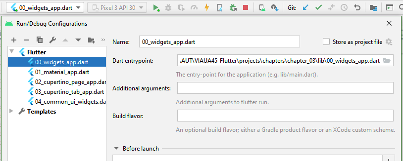

## The App Widgets

While we definitely *could* build every aspect of a Flutter app ourselves from the ground up, it doesn't mean we really *should* go down that path.

The [`WidgetsApp`](https://api.flutter.dev/flutter/widgets/WidgetsApp-class.html) widget is there for us to provide basic functionality for our apps.

By using a `WidgetsApp` as the direct child of our app widget, it helps to implement the
following functionalities:

- Defining the default text style for every widget in the app
- Handling localization
- Navigation between pages (screens)
- Handling overlays, like dialogs that can be displayed over other content

`WidgetsApp` seems to be a class with a lot of responsibilities, but it delegates these
responsibilities to other widgets under the hood, like [`DefaultTextStyle`](https://api.flutter.dev/flutter/widgets/DefaultTextStyle-class.html), or [`Navigator`](https://api.flutter.dev/flutter/widgets/Navigator-class.html).

If our goal was to build a game with widgets only or to build a regular app with our own design language, `WidgetsApp` pretty much has us covered.

A really simple app with a single page built with `WidgetsApp` looks like this:

```dart
import 'package:flutter/widgets.dart';

void main() {
  runApp(const WidgetsAppDemo());
}

class WidgetsAppDemo extends StatelessWidget {
  const WidgetsAppDemo({Key? key}) : super(key: key);

  Route generateRoutes(RouteSettings settings) {
    return PageRouteBuilder(
      pageBuilder: (BuildContext context, Animation<double> animation,
          Animation<double> secondaryAnimation) {
        return const WidgetsAppDemoPage();
      },
    );
  }

  @override
  Widget build(BuildContext context) {
    return WidgetsApp(
      title: 'WidgetsApp Demo',
      // Theming is very limited with WidgetsApp only.
      color: const Color.fromARGB(255, 0, 255, 0),
      initialRoute: "/",
      // If we use multiple pages, we have to define exactly how navigation should happen between them.
      onGenerateRoute: generateRoutes,
      textStyle: const TextStyle(
        color: Color.fromARGB(255, 0, 0, 0),
      ),
    );
  }
}

class WidgetsAppDemoPage extends StatelessWidget {
  const WidgetsAppDemoPage({Key? key}) : super(key: key);

  @override
  Widget build(BuildContext context) {
    return Container(
      color: const Color.fromARGB(255, 255, 255, 255),
      child: Column(
        mainAxisAlignment: MainAxisAlignment.center,
        children: const [
          Padding(
            padding: EdgeInsets.symmetric(vertical: 24.0),
            child: Text(
              "The Main Menu of a\nLegendary Game",
              textAlign: TextAlign.center,
            ),
          ),
          Padding(
            padding: EdgeInsets.symmetric(vertical: 8.0),
            child: Text(
              "New Game",
              textAlign: TextAlign.center,
            ),
          ),
          Padding(
            padding: EdgeInsets.symmetric(vertical: 8.0),
            child: Text(
              "Load Game",
              textAlign: TextAlign.center,
            ),
          ),
          Padding(
            padding: EdgeInsets.symmetric(vertical: 8.0),
            child: Text(
              "Exit",
              textAlign: TextAlign.center,
            ),
          ),
        ],
      ),
    );
  }
}
```

Running the app gives a plain black and white UI:

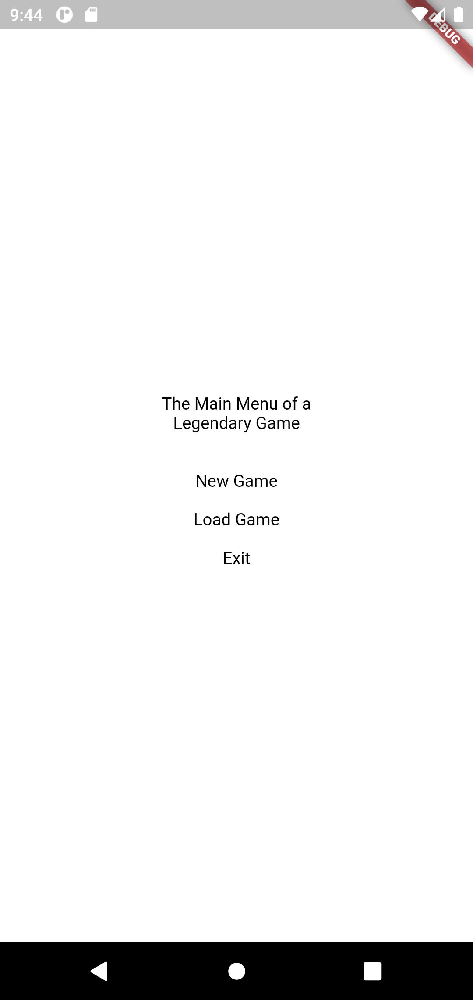

See [00_widgets_app.dart](/projects/chapters/chapter_03/lib/00_widgets_app.dart).

However, Flutter has built-in support for [Material Design](https://material.io/), Google's all-around design language, and even for Apple's [Human Interface Guidelines on iOS](https://developer.apple.com/design/human-interface-guidelines/ios/). Flutter's implementation of the latter is called [Cupertino](https://flutter.dev/docs/development/ui/widgets/cupertino).

> As we already know from the previous chapters, Flutter is using the supported platforms' native canvases to render UI widgets.
> This means that _technically_ we can build an app using Cupertino UI widgets only, and the app will run on all supported platforms, though due to licensing issues, Cupertino won't have the correct fonts on any other platform than iOS or macOS.

Let's take a closer look at some app building blocks from the aforementioned implementations.

## Material Design app basics

### MaterialApp

[`MaterialApp`](https://api.flutter.dev/flutter/material/MaterialApp-class.html) is a `StatefulWidget` wrapping many other widgets that are required for material
design applications. It builds upon and extends the functionality of a `WidgetsApp`.

One of the extra functionalities that `MaterialApp` offers is Material-specific navigation handling (navigation meaning navigating between pages). We'll get back to discussing navigation in Chapter 5 of this material.

`MaterialApp` is also responsible for providing default theme and style values for Material widgets.

#### ThemeData

We can use `ThemeData` objects to configure themes for Material apps.

Material theme colors (like `primaryColor` or `accentColor`) can be defined individually in
a [`ThemeData`](https://api.flutter.dev/flutter/material/ThemeData-class.html), but *swatches* can also be used. A *swatch* is a collection of color shades generated (and for built-in swatches, hardcoded) from a base color. A *swatch* is a *color palette*.

The [official documentation of the Material color system](https://material.io/design/color/the-color-system.html) goes into further details about color palettes. Also, if we wanted to create our own Material color palette, we could use the [color tool](https://material.io/resources/color/).

Apart from the main theme colors, we can customize most of the Material widgets' colors individually with a `ThemeData`, as well as global text and icon themes.

### Scaffold

[`Scaffold`](https://api.flutter.dev/flutter/material/Scaffold-class.html) implements the basic layout structure of a Material Design page. Although it has many *slots* that accept `Widget`s, some widgets are designed to be used together
with `Scaffold` to make creating standard Material pages a breeze.

A `Scaffold` can manage the following Material components (the list is not exhaustive):

- [App bar](https://material.io/components/app-bars-top)
- [Floating action button](https://material.io/components/buttons-floating-action-button)
- [Navigation drawer](https://material.io/components/navigation-drawer)
- [Bottom navigation](https://material.io/components/bottom-navigation)

The middle area of a `Scaffold` is called the `body`. We can use the `body` of a `Scaffold` to display the contents of a page and - not very surprisingly - we can use any `Widget` to do so.

The basic Counter example app already builds upon `Scaffold`, filling the `appBar`, `body`, and `floatingActionButton` slots.

### AppBar

The `AppBar` widget implements a standard Material [app bar](https://material.io/components/app-bars-top) (also known as a Toolbar, previously known as an ActionBar).

The following example demonstrates how we can build a `Scaffold` and an `AppBar`:

```dart
MaterialApp(
  theme: ThemeData(
    primarySwatch: Colors.green,
    visualDensity: VisualDensity.adaptivePlatformDensity,
  ),
  home: Scaffold(
    appBar: AppBar(
      leading: Text("Leading widget"),
      title: Text("App title"),
      actions: <Widget>[
        Text("Action1"),
        Text("Action2")
      ],
    ),
  ),
);
```


We have full control over the content of an `AppBar`'s slots. Instead of a back navigation arrow or a hamburger menu icon, we can use any `Widget` to define the leading content, and the title can also be any `Widget`, not just `Text`.

While we're free to build any widget hierarchy for `AppBar`s slots, some widgets play nicely with `AppBar` by design:

- `Icon`
- `IconButton`
- `PopupMenuButton`

> We'll discuss widgets implementing more Material Design UI elements in Chapter 5.

## Cupertino app basics

Now, let's get familiar with the basic structure of Cupertino pages.

### CupertinoApp

The `CupertinoApp` widget has the same responsibilities as its [Material counterpart](#materialapp).
One significant difference between the behaviors of `CupertinoApp` and `MaterialApp` surfaces when we don't define the top-level themes explicitly. `MaterialApp`'s theme defaults to the value of `ThemeData.light()`, while `CupertinoApp` will use colors provided by iOS.

#### CupertinoThemeData

As the [Human Interface Guidelines' Color](https://developer.apple.com/design/human-interface-guidelines/ios/visual-design/color/) section suggests, `CupertinoThemeData` has much less flexibility compared to Material's `ThemeData`. We can only define four colors and the theme of the texts.

### CupertinoPageScaffold and CupertinoTabScaffold

There are two kinds of scaffold for the Cupertino framework:

- [`CupertinoPageScaffold`](https://api.flutter.dev/flutter/cupertino/CupertinoPageScaffold-class.html),
- [`CupertinoTabScaffold`](https://api.flutter.dev/flutter/cupertino/CupertinoTabScaffold-class.html)

`CupertinoPageScaffold` has a navigation bar slot at the top of the page, and a body slot (called `child`) for the page content.

`CupertinoTabScaffold` implements a typical iOS style page with support for bottom navigation tabs.

The navigation bar implementation is called [`CupertinoNavigationBar`](https://api.flutter.dev/flutter/cupertino/CupertinoNavigationBar-class.html), and the bottom navigation tab implementation is called [`CupertinoTabBar`](https://api.flutter.dev/flutter/cupertino/CupertinoTabBar-class.html).

A CupertinoPageScaffold example:

```dart
CupertinoApp(
      home: CupertinoPageScaffold(
        navigationBar: CupertinoNavigationBar(
          leading: CupertinoNavigationBarBackButton(previousPageTitle: "Back",), // Only works when a valid navigation route exists to a previous page
          middle: Text("Page title"),
          trailing: Icon(CupertinoIcons.info),
        ),
        child: Center(
          child: Column(
            mainAxisAlignment: MainAxisAlignment.center,
            children: [
              Text("App body"),
              CupertinoButton(
                child: Text("Press me"),
                onPressed: () {},
              )
            ],
          ),
        ),
      ),
    );
```

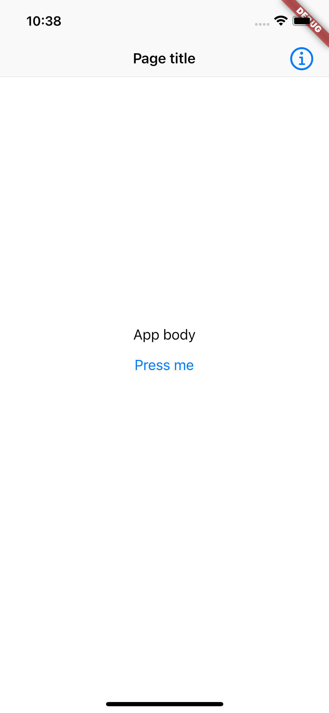

A `CupertinoTabScaffold` example:

```dart
CupertinoApp(
  theme: CupertinoThemeData(),
  debugShowCheckedModeBanner: false,
  home: CupertinoTabScaffold(
    tabBar: CupertinoTabBar(
      items: const <BottomNavigationBarItem>[
          BottomNavigationBarItem(
              icon: Icon(CupertinoIcons.home),
              label: "Products",
          ),
          BottomNavigationBarItem(
              icon: Icon(CupertinoIcons.search),
              label: "Search",
          ),
          BottomNavigationBarItem(
              icon: Icon(CupertinoIcons.shopping_cart),
              label: "Cart",
          ),
      ],
    ),
    tabBuilder: (context, index) {
      late CupertinoTabView returnValue;
      switch (index) {
        case 0:
          returnValue = CupertinoTabView(builder: (context) {
              return CupertinoPageScaffold(
                  child: Center(child: Text("Products"),),
              );
          });
          break;
        case 1:
          returnValue = CupertinoTabView(builder: (context) {
              return CupertinoPageScaffold(
                  child: Center(child: Text("Search"),),
              );
          });
          break;
        case 2:
          returnValue = CupertinoTabView(builder: (context) {
              return CupertinoPageScaffold(
                  child: Center(child: Text("Cart"),),
              );
          });
          break;
      }
      return returnValue;
    },
  ),
);
```

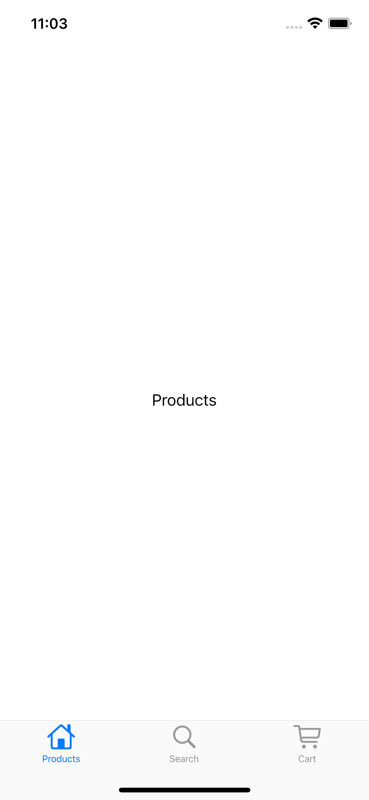

At this point, for the sake of the length of this chapter and the whole course, we'll part with
Cupertino for now. The Google codelab titled [*Building a Cupertino app with Flutter*](https://codelabs.developers.google.com/codelabs/flutter-cupertino) gives a detailed tutorial on how to build apps with Cupertino.

From now on, the code samples and examples we'll be discussing will assume a Material app environment, as we can use the Material library on all supported platforms without any restrictions.

> While Material Design is, to an extent, a viable concept for iOS apps too, keep in mind that iOS users have their own design system they are familiar with. This means that an app designed strictly with Android and Material in mind may not be appealing or even acceptable for iOS users.
> 
> In some cases, a considerable approach is to let both Material and Cupertino go (or mix and match them cleverly) and implement the app's own design language that works for most of the potential users.
> 
>There are many apps out there that tackled this challenge. Such apps can easily be found at https://itsallwidgets.com/.

With that in mind, let's have a look at some of the most commonly used UI and layout widgets in Flutter's arsenal.

## Common UI Widgets

In this section, we'll see a few basic UI widgets which are essential building blocks of most Flutter apps.

### Text

We've already seen the [`Text`](https://api.flutter.dev/flutter/widgets/Text-class.html) widget in action briefly in Chapter 2. Unsurprisingly, the `Text` widget can render a piece of text on the screen.

The easiest way to use `Text` is by simply passing a `String` as its only positional required
parameter. In this case, the displayed text's properties are defined by the closest enclosing [`DefaultTextStyle`](https://api.flutter.dev/flutter/widgets/DefaultTextStyle-class.html).

`Text` is highly customizable. We can define custom [`TextStyle`](https://api.flutter.dev/flutter/dart-ui/TextStyle-class.html) objects - or use existing ones from a [`Theme`](https://api.flutter.dev/flutter/material/Theme-class.html) - to tell `Text` how we want it to render its content.

The following example shows some properties of `TextStyle` in action:

```dart
Text(
  '$_counter',
  style: TextStyle(
    color: Colors.red,
    fontSize: 32,
    fontStyle: FontStyle.italic,
    fontWeight: FontWeight.bold,
    decoration: TextDecoration.underline,
    decorationStyle: TextDecorationStyle.dotted,
  ),
),
```


### Icon

While most UI frameworks have only one basic component for displaying any kind of image, Flutter differentiates between *images* and drawables that are meant to be used as *icons*.

The built-in icons themselves are provided as fonts (*MaterialIcons* and *CupertinoIcons*). Having `uses-material-design: true` and/or the `cupertino_icons` dependency in our project's *pubspec.yaml* makes the mentioned fonts available to use.

We can use the `Icon` widget to display such icons. Working with the `Icon` widget is similar to `Text`: the only positional required parameter is the icon to display (which can be `null`!). If not specified, all other parameters default to the ambient `IconTheme` if available. If an ambient `IconTheme` is not available, hardcoded default values apply.

> Taking `Icon`s `color` as an example, as stated in the official documentation:
>
> "Defaults to the current `IconTheme` color, if any.
>
> The given color will be adjusted by the opacity of the current `IconTheme` if any.
>
> In material apps, if there is a `Theme` without any `IconTheme`s specified, icon colors default to white if the theme is dark and black if the theme is light.
> 
>If no `IconTheme` and no `Theme` is specified, icons will default to black."

Icons passed to `Icon` are expected to be squared. Non-squared icons may render incorrectly.

The following example shows how to display the Android logo as an icon:

```dart
Icon(
  Icons.android,
  color: Colors.greenAccent,
  size: 40,
),
```


### Image

Most apps have to display some images in one way or another. Images can come from our app's asset bundle, the device's local storage, from the network, or an in-memory bitmap.

We can use the `Image` widget to display images from each of the said sources.

We've already seen how to include images in an app's asset bundle in [Chapter 2](02.md).

Let's assume that there's a file named *logo_flutter.png* in our project's *assets/images* 
directory. To access the file as an image asset, we need to add either the file's or the directory's relative path to the project's *pubspec.yaml* file:

```yaml
flutter:
  ...
  assets:
    - assets/images/ # <- Here
```

We could use `Image`'s primary constructor to load *logo_flutter.png* by explicitly creating an  `AssetImage`:

```dart
Image(
  image: AssetImage('assets/images/logo_flutter.png'),
),
```

Yet, there is a smarter, named constructor for loading images from assets, which attempts to load the pixel-density-aware asset, if available:

```dart
Image.asset(
  'assets/images/logo_flutter.png',
  height: 100,
),
```

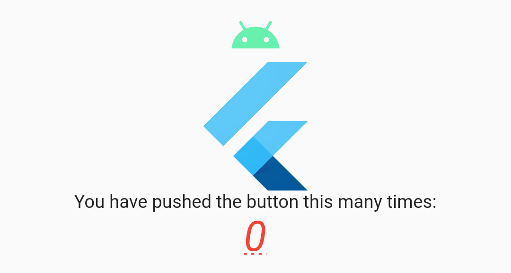

If we don't specify the exact height and width of an image, its content will be sized based on the `fit` parameter, which can be an instance of [`BoxFit`](https://api.flutter.dev/flutter/painting/BoxFit-class.html) (see the documentation for a detailed description of each fitting strategy).

Loading images from the default asset bundle is straightforward. So is loading images from the file system of the device by using the `Image.file(File)` constructor.

On the other hand, a more interesting topic is loading images from the network (by URLs). For  example, Android needs 3rd party libraries (Picasso, Glide, Coil) to make image loading as easy as possible, and so does iOS.

With Flutter, asynchronously loading an image from a URL is as simple as it can be (without any extra parameters of course):

```dart
Image.network(
  "https://picsum.photos/150",
),
```

> https://picsum.photos is the address of *Lorem Picsum*, a neat random placeholder image provider.

If our image provider backend needs extra headers (for example to authenticate the request), we can provide a `Map<String, String>` containing the required headers.

```dart
Image.network(
  "https://picsum.photos/150",
  headers: {
    "Authorization": "Bearer 0123456789"
  },
),
```

`Image` also supports displaying any widget we wish to display as a loading indicator:

```dart
Image.network(
  "https://picsum.photos/150",
  loadingBuilder: (BuildContext context, Widget child,
      ImageChunkEvent? loadingProgress) {
    if (loadingProgress == null) return child;
    return Center(
      child: CircularProgressIndicator(
        value: loadingProgress.expectedTotalBytes != null
            ? loadingProgress.cumulativeBytesLoaded /
                loadingProgress.expectedTotalBytes!
            : null,
      ),
    );
  },
),
```

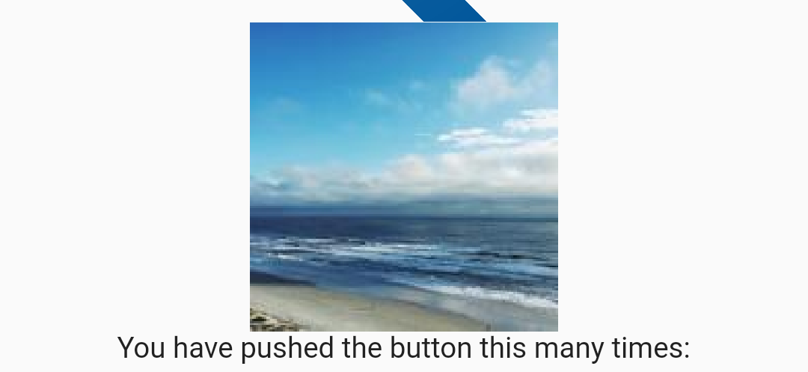

> Although the built-in `Image` widget can be really useful in simple situations, using the [cached_network_image](https://pub.dev/packages/cached_network_image) package is highly recommended, as it makes caching, and handling loading and error states even easier.  

Displaying an image from memory only requires a list of the bytes of the image.

### SizedBox

`SizedBox` is a widget with two main functionalities:

- If it has a child, `SizedBox` forces its child to have the same dimensions as itself 
  ([if the dimension values are permitted by its parent](https://flutter.dev/docs/development/ui/layout/constraints) - we'll explore this topic in Chapter 9 of this material).
    - This mode is useful for constraining the size of other widgets.
  
- If it doesn't have a child, `SizedBox`just takes up the space on the screen but doesn't render anything.
    - This way, `SizedBox` can act as a spacer between other widgets.

```dart
SizedBox(
  width: 80,
  height: 20,
  child: Container(
    color: Colors.brown,
  )
),
```

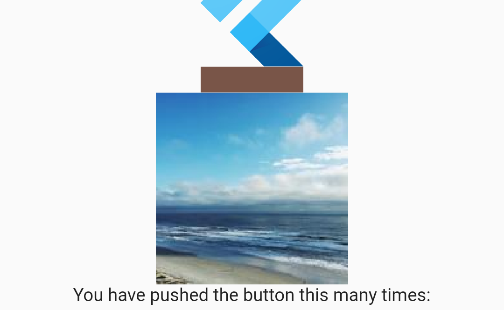

## Layout Widgets

In this section, we'll be discussing widgets that are responsible for the position and/or the size of their children. In other words, these widgets ([along with many others](https://flutter.dev/docs/development/ui/widgets/layout))
make up the *layout* of our pages most of the time.

We've already encountered some of them in [Chapter 2](02.md#flutter-ui---basics) while exploring the Counter starter app.

### Container

`Container` is a convenience widget that can provide padding, margin, positioning, and sizing to its child widget. It can also render background and foreground decoration.

The following code snippet demonstrates a small subset of what `Container` can do:

```dart
Container(
  margin: EdgeInsets.all(16),
  padding: EdgeInsets.all(16),
  decoration: BoxDecoration(
    shape: BoxShape.rectangle,
    border: Border.all(
      color: Colors.black,
      width: 8,
    ),
    color: Colors.blueGrey,
    borderRadius: BorderRadius.circular(8)
  ),
  alignment: Alignment.center,
  child: ...
)
```

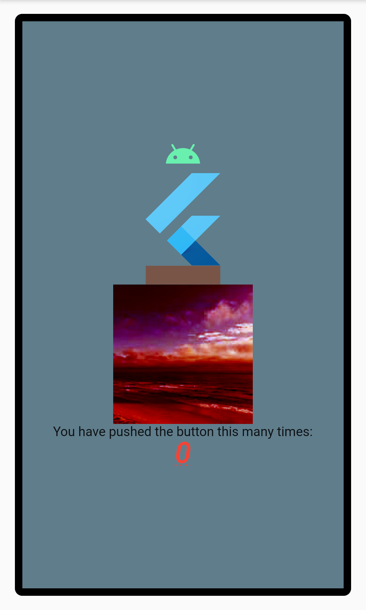

`Container` has a rather complex layout behavior which is detailed in its [official documentation](https://api.flutter.dev/flutter/widgets/Container-class.html).

### Center

`Center` does exactly what its name suggests. It positions its only child to the center of its own area. If constrained on both dimensions, `Center` will be as big as possible.

```dart
Center(
  child: Text("Centered Text"),
),
```

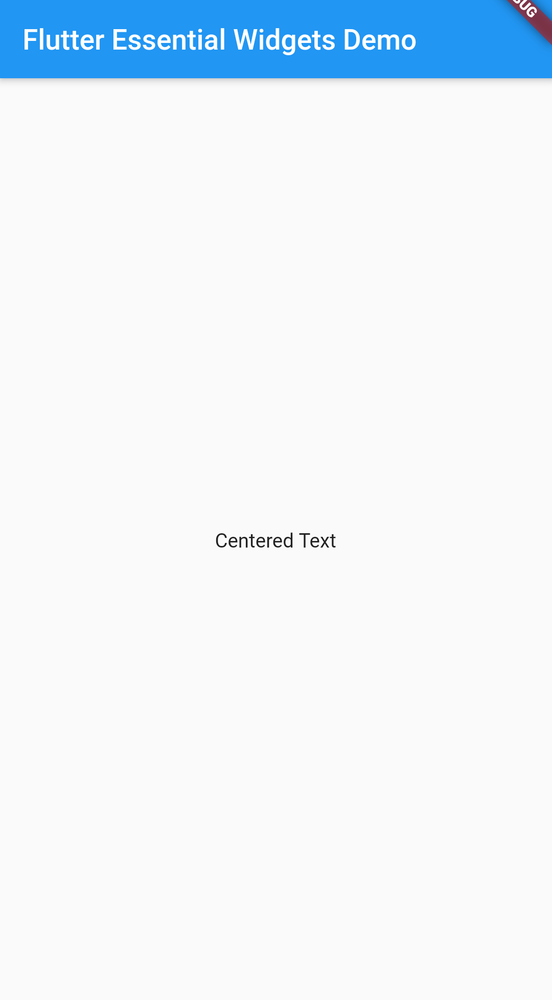

### Column

`Column` is a layout widget that displays its children vertically one after another. It's analogous to Android's `LinearLayout` with vertical orientation and iOS's vertical Stack View.

`Column` itself is not scrollable (but by default tries to occupy as much space as it can), thus building one with more children than what will fit into the available space is generally considered an error - in such cases, [`ListView`](https://api.flutter.dev/flutter/widgets/ListView-class.html) is a better choice.

Again, `Column` is a layout widget that we've already seen in the Counter project.

```dart
Column(
  mainAxisAlignment: MainAxisAlignment.center,
  crossAxisAlignment: CrossAxisAlignment.center,
  mainAxisSize: MainAxisSize.min,
  children: <Widget>[
    Text("First widget in a column"),
    Text("Second widget in a column"),
  ]
),
```

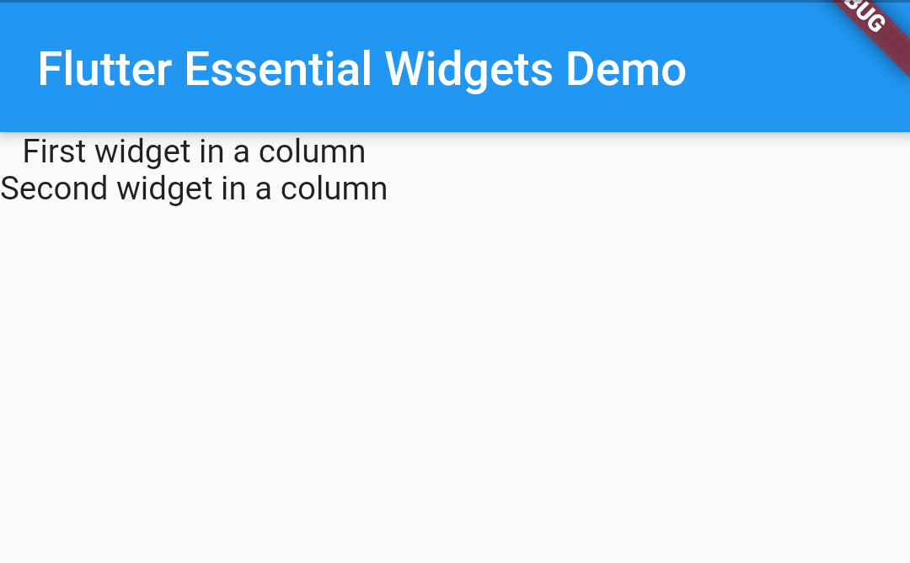

### Row

`Row` is the horizontal variant of `Column`, the only difference being that `Row`'s main axis is the horizontal axis.

```dart
Row(
  mainAxisAlignment: MainAxisAlignment.center,
  crossAxisAlignment: CrossAxisAlignment.center,
  mainAxisSize: MainAxisSize.min,
  children: <Widget>[
    Icon(
      Icons.android,
      color: Colors.greenAccent,
      size: 40,
    ),
    Icon(
      Icons.alarm,
      color: Colors.orangeAccent,
      size: 40,
    ),
  ]
),
```

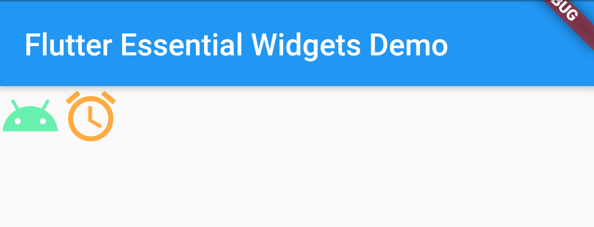

### Expanded

The `Expanded` widget works with `Row` and `Column` (and `Flex`, which we won't be discussing in this chapter) and makes its child fill the available space on the main axis of those widgets. Additionally, if multiple children on the same level are expanded, we can set the so-called *flex factor* on `Expanded` widgets to control the division of available space between them.

```dart
Column(
  mainAxisAlignment: MainAxisAlignment.center,
  crossAxisAlignment: CrossAxisAlignment.center,
  children: <Widget>[
    Expanded(
      flex: 3,
      child: Image.asset(
        'assets/images/logo_flutter.png',
        height: 100,
      ),
    ),
    Expanded(
      flex: 2,
      child: Image.network(
        "https://picsum.photos/150",
      ),
    ),
  ]
),
```

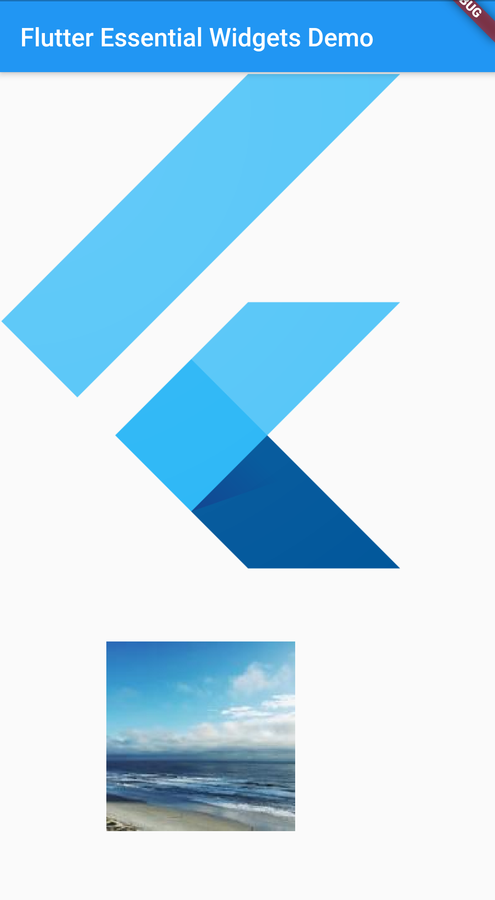

### Stack

`Stack` is a powerful layout widget that positions its children relative to its edges. Also, its
children can overlap. The Z-order of the children is defined by the order they appear in `Stack`s list of children.

`Stack`s children are either *positioned* or *non-positioned*, positioned meaning *wrapped in a 
configured `Positioned` widget*. `Stack` sizes itself to contain all the non-positioned children 
(which are positioned by alignment, which defaults to top-left in left-to-right environments and top-right in right-to-left environments), then it places the positioned children relative to the edges.

```dart
Stack(g
  children: <Widget>[
    Container(...),
    Positioned(
      left: 250,
      top: 230,
      child: Image.asset(
        'assets/images/logo_flutter.png',
        height: 100,
      ),
    ),
  ]
),
```


## Conclusion

In this chapter, we've learned how to start building a Flutter app without any design language support, then we discussed the built-in Material and Cupertino support. We've got to try some essential UI and layout widgets and learned some fundamental techniques for building beautiful UIs with Flutter in the future. In the next chapter, we'll learn about asynchronous programming in Dart and we'll look into app state management with the [provider](https://pub.dev/packages/provider) and [bloc](https://pub.dev/packages/bloc) packages.

## References, materials, further reading

- [Layouts in Flutter](https://flutter.dev/docs/development/ui/layout)
- [Understanding constraints](https://flutter.dev/docs/development/ui/layout/constraints)
- [Building a Cupertino app with Flutter (Codelab)](https://codelabs.developers.google.com/codelabs/flutter-cupertino)
- [It's All Widgets!](https://itsallwidgets.com/)
- [Assets and images - flutter.dev](https://flutter.dev/docs/development/ui/assets-and-images) 
- [Flutter Complete Reference - Alberto Miola](https://fluttercompletereference.com/)

