# Chapter 5: Advanced widgets, navigation, animation

> **"BREAKING" NEWS**: As of *2021.03.03.* (the [Flutter Engage](https://www.youtube.com/watch?v=yll3SNXvQCw) event), Flutter 2 hit stable status along with Dart 2.12.0. We strongly recommend updating to and using these new versions from now on. We were preparing for this right from the start of the course, so this may not be a large overhead.
> 
> To switch to the stable channel of the Flutter SDK and start using Flutter 2 and Dart 2.12.0, run the `flutter channel stable` console command followed by `flutter upgrade`.

## Input widgets

Input widgets do just what their category name suggests: they are responsible for capturing input events. Flutter has all the different types of input widgets we are used to see and use in applications having graphical UIs. We'll go over Material implementations of a few such widgets.

The example project for this section is [input_widgets_demo](../projects/chapters/chapter_05/input_widgets_demo), and it implements a search page with some reasonable input choices:

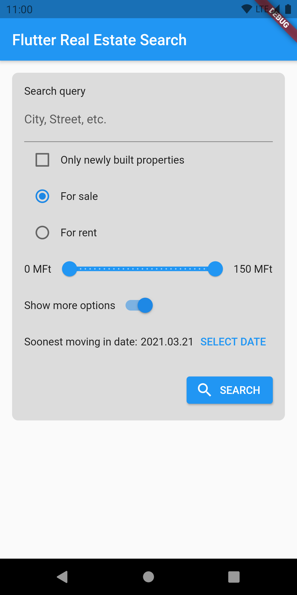

The page is implemented in [form/real_estate_search_form_page.dart](../projects/chapters/chapter_05/input_widgets_demo/lib/inputs_demo/form/real_estate_search_form_page.dart) and it's entire state is handled by a single Cubit which can be found in [bloc/real_estate_search_form_cubit.dart](../projects/chapters/chapter_05/input_widgets_demo/lib/inputs_demo/bloc/real_estate_search_form_cubit.dart).

Let's go through each input widget type from the top to the bottom and see how we can use them.

### TextField

`TextField` is responsible for collecting written user input. While `TextField` has all the bells and whistles that most UI toolkits offer in their input field implementations, let's focus on just a few important aspects of text input handling: showing a label or hint, and using the value given by the user.

Implementing an animated label defined by Material Desing is fairly easy with Flutter. We only have to provide an `InputDecoration` with a label text to get these results:

|  No focus and value    |  Has focus and value    |
| :----: | :----: |
|      |      |

As for handling the value, we have to declare and create a `TextEditingController` instance and pass the reference of it to the `TextField` when it is built.

```dart
final queryTextController = TextEditingController();

TextField(
  decoration: InputDecoration(
    labelText: "City, Street, etc.",
  ),
  controller: queryTextController,
),
```

> We can do much more customization with `InputDecoration`. Feel free to experiment with its parameters.

We can access the current value entered into the `TextField` like this (the example is taken from the search button's click handler):

```dart
ScaffoldMessenger.of(context).showSnackBar(
  SnackBar(
    content: Text(queryTextController.value.text), // <- this
  ),
);
```

We shouldn't forget to dispose all `TextControllers` in the `State`'s `dispose()` method:

```dart
@override
void dispose() {
  queryTextController.dispose();
  super.dispose();
}
```

### Checkbox

Checkboxes are really easy and intuitive to use in Flutter. The following snippet is from `checkbox_row.dart`:

```dart
class CheckboxRow extends StatelessWidget {
  @override
  Widget build(BuildContext context) {
    final isNewlyBuiltChecked =
        context.watch<RealEstateSearchFormCubit>().state.isNewlyBuiltChecked;
    return Row(
      children: [
        Checkbox(
          value: isNewlyBuiltChecked,
          onChanged: (checked) {
            if (checked != null) {
              context.read<RealEstateSearchFormCubit>().newlyBuiltCheckedChanged(checked);
            }
          },
        ),
        Text("Only newly built properties")
      ],
    );
  }
}
```

As we can see, a `Checkbox` only needs it's current value at the time of rebuilding, and we can add a listener to be called when the `Checkbox`'s value is changed. In this example, the current value comes from our Cubit, and the new value is also sent to it so it could refresh the state accordingly.

### Radio group

### Sliders

### Switch

### DatePicker

## Navigation

As we can already know from previous chapters, screens in Flutter are basically just widgets (remember, everything is a widget!). The terminology of Flutter for a screen is "page".

There are a few approaches we can choose for navigating between pages. There is the older, but still versatile Navigator 1.0, which was Flutter's first solution for navigation, and the newer, shinier, declarative approach called Navigator 2.0.

As navigation is already a complex topic by itself without the added complexity of Navigator 2.0, we will stick to using Navigator 1.0 for now.

> To learn more about Navigator 2.0 and the differences between the two frameworks, check out the [Navigation and routing](https://flutter.dev/docs/development/ui/navigation) page of the official documentation, along with [this artice](https://medium.com/flutter/learning-flutters-new-navigation-and-routing-system-7c9068155ade). Feel free to experiment with 2.0.

While we'll be using Widgets as pages of our apps, the widgets themselves know nothing about themselves being *pages*. For a widget to behave as a page, it needs to be wrapped inside a [`Route`](https://master-api.flutter.dev/flutter/widgets/Route-class.html) implementation - either [`MaterialPageRoute`](https://master-api.flutter.dev/flutter/material/MaterialPageRoute-class.html), [`CupertinoPageRoute`](https://master-api.flutter.dev/flutter/cupertino/CupertinoPageRoute-class.html), or a custom implementation - which holds data about the navigation state and behavior.

> As in previous chapters, for the sake of simplicity, we'll only be looking at Material implementations. However, the following examples are easily adaptable to Cupertino.

### Imperative navigation - Navigator 1.0

The following examples can be found in the [navigation_imperative](../projects/chapters/chapter_05/navigation_imperative) project.

Let's open the *main.dart* file in the project, which contains the `main()` function of the app and the app widget, which wraps a `MaterialApp` widget. There are already some navigation related parameters set, but before diving into those details, let's check out the `home` parameter of `MaterialApp`'s constructor.

```dart
MaterialApp(
  title: 'Imperative Navigation Demo',
  theme: ThemeData(
    primarySwatch: Colors.blue,
    visualDensity: VisualDensity.adaptivePlatformDensity,
  ),
  home: MainPage(), // <-- this
  ...
);
```

The `home` parameter has a relatively extensive documentation, but in a nutshell, if it is set, the provided Widget (tree) will be the landing page of the app. In web and URI terms, the home page will be on the root ("/") path. Building and running the project yields the following state:

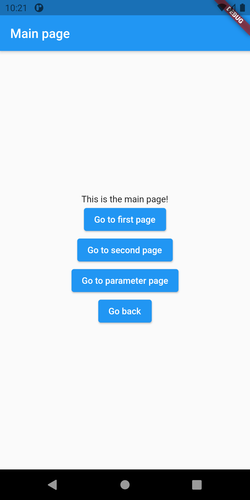

#### The navigation parameters of `MaterialApp`

Before discussing the contents of `MainPage`, let's take a step back and look at the other navigation related parameters of `MaterialApp`. The first thing to notice is the `routes` parameter, which takes a `Map` having `String` keys and `Widget` building lambda functions as values.

```dart
MaterialApp(
  ...
  routes: {
    "/firstpage": (context) => FirstPage(),
    "/secondpage": (context) => SecondPage(),
  },
  ...
);
```

This is how we can define the top-level static routing table of an application and this enables navigation directly by route names. The starting slash in the route names above are not necessary, but keeping the URI format in route names definitely helps when targeting the Web.

We can, in fact, define the home page by providing a route in `routes` with the key "/" (the root path), but doing so while also using the `home` parameter will result in a runtime assertion error. 

>This behavior is well-documented in both `home`'s and `routes`' inline documentation:
>`home`: "If `home` is specified, then `routes` must not include an entry for /, as home takes its place."
>`routes`: "If `home` is specified, then it implies an entry in this table for the `Navigator.defaultRouteName` route (/), and it is an error to redundantly provide such a route in the `routes` table.

There are two more parameters we'll be using in our navigation example: `onGenerateRoute` and `onUnknownRoute`.

```dart
MaterialApp(
  ...
  onGenerateRoute: (route) {
    return null;
  },
  onUnknownRoute: (route) {
    return MaterialPageRoute(
      builder: (_) => ParameterPage(
        parameter: route.toString(),
      ),
    );
  },
);
```

The `onGenerateRoute` callback allows us to handle navigation to named routes that are not listed in the static routing table (`routes`). The object we receive here as input is of the [`RouteSettings`](https://master-api.flutter.dev/flutter/widgets/RouteSettings-class.html) class and contains the requested route, and the arguments associated with the navigation request. The arguments object is delivered as an `Object?` instance and it's up to us to cast it and parse the contents before usage.

> Navigation arguments are usually used for passing data between screens. A typical example of this is a list-detail app, where clicking a list item takes the user to the details screen, passing the selected item's ID to it for the screen to know which item's details to load.

There may be a situation, when we receive a route name that we are not prepared to handle. In this case we can return a default Widget of our choice, or `null` from `onGenerateRoute`. In the latter case, the `onUnknownRoute` callback will be called, where we get the last chance to show at least a meaningful error or explanation page to the user.

The situation we just discussed can be rather strange to mobile app developers. How can we get a navigation request which's route doesn't exist? One way would be to receive a deep link from a notification that the app cannot handle (this would imply that a poor choice has been made somewhere in the release cycle, though). However, remember that we can target the Web with Flutter, which world's navigation is based on URIs. If we were to request a web app's resource by URI that doesn't exist, we are most likely to be presented with some form of a 404 (resource *Not found*) page. This behavior is what we can achieve by using `onGenerateRoute` or  `onUnknownRoute`, and it is also suitable for mobile and desktop targets alike.

> Although we *can* use `onGenerateRoute` to implement the "404" page (with a non-`null` return value when we couldn't handle the received route), `onUnknownRoute` is *the* place to do it by design.

If we set `home`, `routes`, `onGenerateRoute`, and `onUnknownRoute`, `MaterialApp` creates a `Navigator` widget and makes all pages to be "under" that `Navigator`. Technically speaking, that `Navigator` will be the (in)direct parent of all pages, so the pages will be able to acquire a reference to the `Navigator` with a `Navigator.of(context)` call.

Now, let's look at the pages we will be navigating between.

#### The home page

The app's home page (`MainPage`) is also implemented in the *main.dart* file. `MainPage` has a rather simple, `Scaffold` based structure. However, `Scaffold` is not the root widget of the page. It's wrapped in a `WillPopScope` widget.

// TODO some text about app navigation stacks somewhere near the beginning of the navigation topic

```dart
class MainPage extends StatelessWidget {
  @override
  Widget build(BuildContext context) {
    return WillPopScope( // <- this
      onWillPop: () async {
        var result = await showDialog(
          context: context,
          builder: (context) {
            return AlertDialog(
              title: Text("Are you sure?"),
              content: Text("Do you really want to quit?"),
              actions: [
                TextButton(
                  child: Text("No"),
                  onPressed: () => Navigator.pop(context, false),
                ),
                TextButton(
                  child: Text("Yes"),
                  onPressed: () => Navigator.pop(context, true),
                ),
              ],
            );
          },
        );
        return result ?? false;
      },
      child: Scaffold(...),
    );
  }
}
```

> In app navigation terms, *pop* means taking the top-most page off the navigation stack, which (in most cases!) is equivalent to *navigating to the previous page*.

The `WillPopScope` widget provides a callback for vetoing back navigation attempts originating from `WillPopScope`'s children. In this app, we simply use this mechanism to show a dismissable `AlertDialog` with two buttons when the user tries to navigate backward from the home page (essentially, when they try to leave the app). Dismissing the dialog, or clicking the *No* button vetoes the back navigation, while clicking the *Yes* lets the navigation event go though, exiting the app.

`MainPage`'s actual content consists of a title `Text` and four `ElevatedButton`s in a `Column`, which all have a navigation-related action set to them. Jumping right to the bottom one (*Go back*), we can see how to handle vetoable back navigation:

```dart
ElevatedButton(
  child: Text("Go back"),
  onPressed: () async {
    var handledPop = await Navigator.maybePop(context); // <- here
    if (!handledPop) {
      SystemNavigator.pop();
    }
  },
),
```

> Throughout this project, we use the `Navigator.[functionName](context)` style functions, which are just wrappers around the `Navigator.of(context).[functionName]()` style functions. The reason for doing so is that the former style hides the fact that we can access `Navigator` via an `InheritedWidget`, and it's more concise.

`maybePop` returns true, if it handled the pop event (if the current route vetoed the pop), and false, if the pop event can go through. By calling `maybePop` here, the enclosing `WillPopScope`'s `onWillPop` callback is called. If we can continue exiting the app, we call `SystemNavigation.pop()` and basically exit the app. This is the recommended way to exit the app programmatically in favor of *dart.io*'s `exit` method, because this way the app closes normally as far as the underlying platform is concerned, while calling `exit()`  may count as a crash.

#### Named navigation

Clicking one of the rest of `MainPage`'s buttons results in a *named* navigation attempt by calling `Navigator.pushNamed(context, name)`.

```dart
ElevatedButton(
  child: Text("Go to first page"),
  onPressed: () {
    Navigator.pushNamed(
      context,
      "/firstpage",
    );
  },
),
ElevatedButton(
  child: Text("Go to second page"),
  onPressed: () {
    Navigator.pushNamed(
      context,
      "/secondpage",
    );
  },
),
ElevatedButton(
  child: Text("Go to parameter page"),
  onPressed: () {
    Navigator.pushNamed(
      context,
      "/parameterpage",
      arguments: "Hello",
    );
  },
),
```

When we initiate a named navigation, `Navigator` will try to look up the provided name in the routing table (defined in `MaterialApp`'s `routes` parameter). If a route exists in the routing table, navigation to the route's target page will happen. We've already discussed what happens when a requested named route is not in the routing table in [the previous section](#the-navigation-parameters-of-materialapp).

Navigating to named routes `"/firstpage"` and `"/secondpage"` from `MainPage` is straightforward, as those routes are in the routing table.

|                   /firstpage                   |                   /secondpage                    |
| :--------------------------------------------: | :----------------------------------------------: |
| 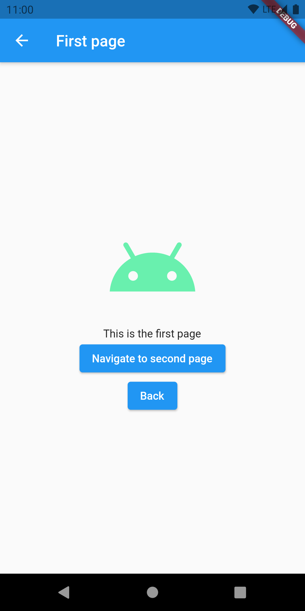 | 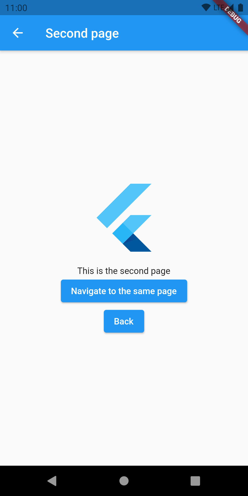 |

Clicking the *Go to parameter page* button on `MainPage` fires a navigation event, passing extra data - an argument object - to it. The navigation argument is handled as an `Object?` type reference, so we can pass any type of object to it, and, more importantly, we are responsible for casting it properly while processing it.

```dart
ElevatedButton(
  child: Text("Go to parameter page"),
  onPressed: () {
    Navigator.pushNamed(
      context,
      "/parameterpage",
      arguments: "Hello", // <- navigation argument object
    );
  },
),
```

Navigation from `MainPage` to `"/parameterpage"` will result in a call to `onUnknownRoute`, where we manually create a `MaterialPageRoute` that wraps a `ParameterPage` and passes the `String` representation of the received `RouteSettigns` object to it. As we can see, the provided `RouteSettings` object contains the name of the requested route and the navigation argument object - in this case, the `String` "Hello".

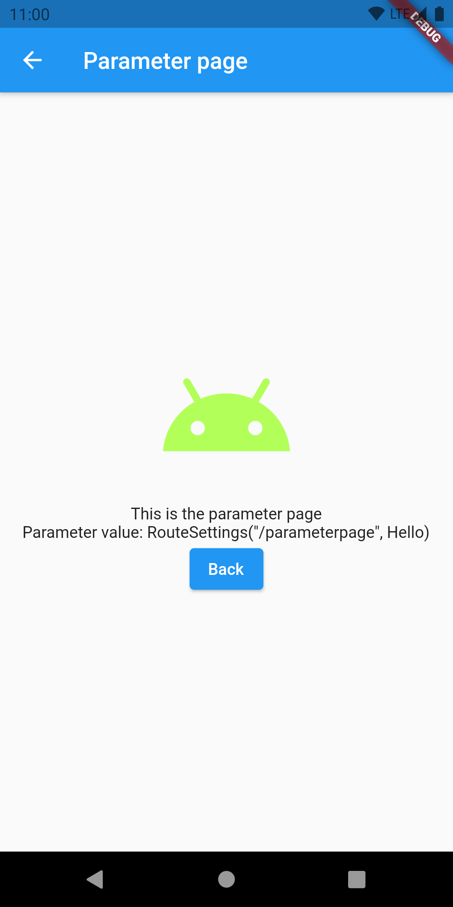

#### Anonymous navigation

The `FirstPage` (in *first_page.dart*) implements the page widget associated with the `"/firstpage"` route. The *Navigate to second page* button's click listener implements a so-called *anonymous navigation* by calling `Navigator.push`. This way, we have to manually create a `Route` instance (we're creating a `MaterialPageRoute` here) and declare the navigation target with it.

```dart
ElevatedButton(
  child: Text("Navigate to second page"),
  onPressed: () {
    Navigator.push( // <- anonymous navigation
      context,
      MaterialPageRoute(
        builder: (context) => SecondPage(), // <- navigation target 
      ),
    );
  },
),
```

This approach grants more freedom than navigating between predefined named routes only, as we can navigate to technically any widget freely. On the other hand, using *only* anonymous navigation loses scalability fast in large projects.

Clicking the *Navigate to second page* button pushes a route containing a `SecondPage` instance. At this point, our navigation stack roughly looks like this:

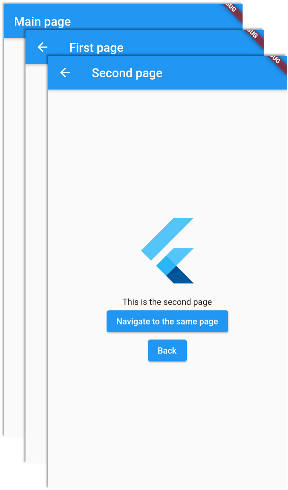

Clicking the *Back* button on either `FirstPage` or `SecondPage` calls `Navigator.pop()`, which results in popping the top-most page off the current stack, which equals to a back navigation in our example.

`SecondPage`'s *Navigate to same page* button does a slightly different navigation that we've seen so far. It replaces the top route on the stack with the newly created one. In practice this means that clicking the *Navigate to same page* any number of times won't add a new stack entry, but the current `SecondPage` instance will be replaced with a new one. Also, clicking the *Back* button on `SecondPage` after that will result in a single back navigation event to the previous page.

> `SecondPage` is actually reachable directly from `MainPage`. Taking that route builds a navigation stack of  `MainPage`->`SecondPage` and the behavior described above stays the same logically.

#### Handling generated routes

Let's get back to the  `MaterialApp` widget in *main.dart* and handle the `"/parameterpage"` as a generated route.

```dart
MaterialApp(
  ...
  home: MainPage(),
  routes: {
    "/firstpage": (context) => FirstPage(),
    "/secondpage": (context) => SecondPage(),
  },
  onGenerateRoute: (route) {
    switch (route.name) { // <- here
      case "/parameterpage":
        return MaterialPageRoute(
          builder: (context) => ParameterPage(
            parameter: route.arguments.toString(),
          ),
        );
    }
    return null;
  },
  onUnknownRoute: (route) {
    return MaterialPageRoute(
      builder: (_) => ParameterPage(
        parameter: route.toString(),
      ),
    );
  },
);
```

The object we receive in the `onGenerateRoute` callback is an instance of the previously mentioned `RouteSettings` class. It holds the requested route name and the arguments object bundled with the navigation request. It's up to us to build and return a `MaterialPageRoute` based on the received data (or `null`, of course).

This time, we'll build a route to `ParameterPage` with the actual argument object passed to it - which is still the "Hello" `String`, but now `ParameterPage` will print just that. 

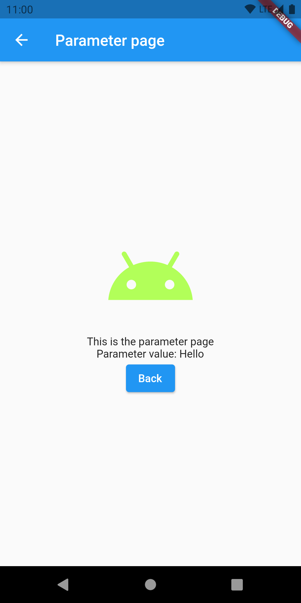

#### Navigation on the Web

We've seen that the navigation methods shown above work quite well on the mobile targets. What about the Web target, where navigation is usually based on URIs?

Well, by using named navigation routes, we already have this base covered, too. Let's build and run the app for the Web target.

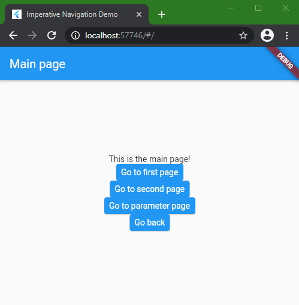

As we can see, the URL of the landing page of the app looks like this: `host/#/`. If we navigate to one of the named routes registered in the routing table, the name of the current route is appended to the URL.

| First page | Second page |
| :----: | :----: |
|  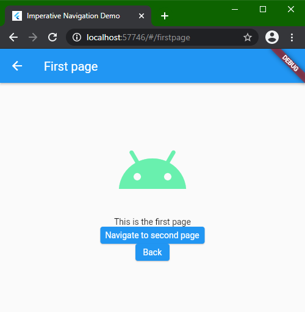    |  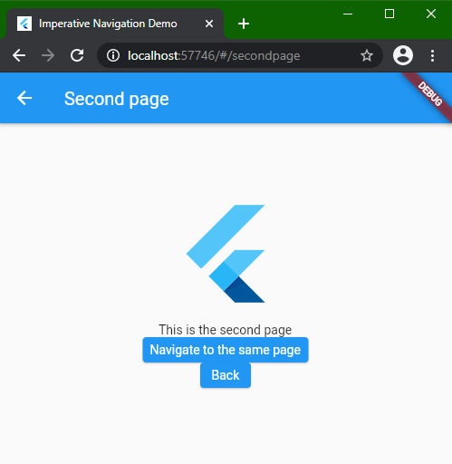    |

> Note that this example app is not complete, so there may be navigation glitches if we tried to access pages by modifying the URL directly.

However, navigating to the `ParameterPage` from the `MainPage` yields a slightly different result:

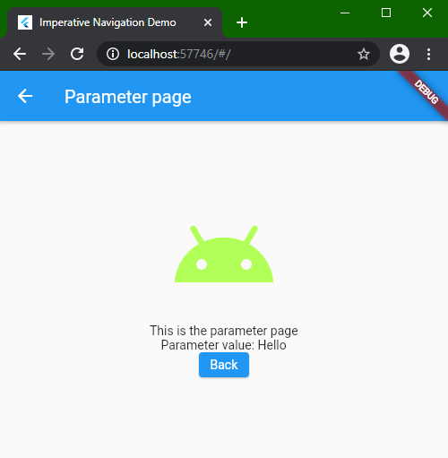

The web URL of a navigation page comes from it's route name, which generated routes don't have by default. Fixing this is as easy as adding a `PageSettings` object to the generated route:

```dart
onGenerateRoute: (route) {
  switch (route.name) {
    case "/parameterpage":
      return MaterialPageRoute(
        settings: RouteSettings(name: "/parameterpage"), // <- here
        builder: (context) => ParameterPage(
          parameter: route.arguments.toString(),
        ),
      );
  }
  return null;
},
```

The URL is properly updated now when navigating to `ParameterPage`.

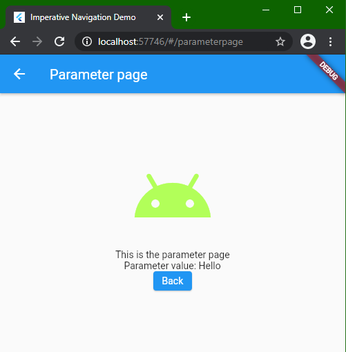

We can even add URL parameter handling by doing some custom computation in `onGenmerateRoute`:

```dart
onGenerateRoute: (route) {
  if (route.name?.contains("/parameterpage/") ?? false) {
    final routeName = route.name!;
    final arg =
        routeName.substring(routeName.lastIndexOf("/")+1, routeName.length);
    return MaterialPageRoute(
      settings: RouteSettings(name: "/parameterpage/$arg"),
      builder: (context) => ParameterPage(
        parameter: Uri.decodeFull(arg),
      ),
    );
  }
  return null;
},
```

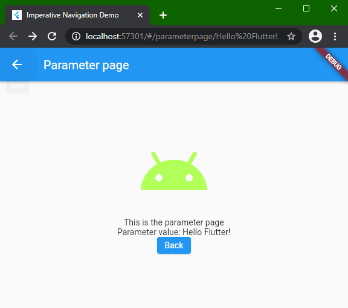

### Navigation with Pages - an intro to Navigator 2.0

The following examples can be found in the  [navigation_pages](../projects/chapters/chapter_05/navigation_pages) project.

Navigator 2.0 has many extra features over Navigator 1.0, but we'll stick to some basic improvements that 2.0 introduced. We'll se how we can manage the navigation stack as a part of the app state.

The example project of this section implements exactly the same functionality that we saw in the imperative navigation sample project. The only difference is in the implementation of navigation.

After opening *main.dart*, we can instantly see that there is a `GlobalKey` named `globalNavigatorHolderKey`. We're using this key to access the custom navigation-stack-manipulating functions of the state we're wrapping a `Navigator` in. Speaking of which, let's take a closer look on the `NavigationHolder` `StatefulWidget`, or to be more precise, it's state implementation, `_NavigatorHolderState`.

The only piece of state `_NavigatorHolderState` handles is a list of `Page`s:

```dart
class _NavigatorHolderState extends State<NavigatorHolder> {
  List<Page> pages = [
    MaterialPage(child: HomeWidget()),
  ];
  ...
}
```

This list will be the actual navigation stack we'll be managing. We prepopulate it with the starting page, a `MainPage` wrapped in a `MaterialPage` object.

Then, in ``_NavigatorHolderState.build`, we explicitly add a `Navigator` to the top of our app's widget tree, instead of relying on `MaterialApp` to do it for us. This `Navigator`'s subtree will be able to access it as usual with `Navigator.of(context)`, and the previously seen wrapper functions.

Since Navigator 2.0, `Navigator` has a `pages` parameter which can be set manually. If the value of `pages` change (the list is updated as state), `Navigator` will arrange navigation according to the new state of the navigation stack.

More flexibility comes with more things to do by hand. As managing the navigation stack is on us with this approach, we're responsible for providing methods and implementations for other parts of the app to be able to manipulate the stack. Just a reminder: with Navigator 1.0, these operations were provided out of the box - this is the cost of flexibility here.

```dart
class _NavigatorHolderState extends State<NavigatorHolder> {
  List<Page> pages = [
    MaterialPage(child: MainPage()),
  ];

  @override
  Widget build(BuildContext context) {
    return Navigator(
      pages: pages.toList(),
      onPopPage: (Route route, dynamic result) { // <- popping the stack manually
        setState(() {
          route.didPop(result);
          pages.removeLast();
        });
        return true;
      },
      onGenerateRoute: (route) {...},
      onUnknownRoute: (route) {...},
    );
  }

  void addNewPage(Widget page) { // <- adding a new page on top of the stack
    setState(() {
      pages.add(MaterialPage(child: page));
    });
  }

  void replaceTopPage(Widget page) { // <- replacing the top page woth a new page
    setState(() {
      pages.removeLast();
      pages.add(MaterialPage(child: page));
    });
  }
}
```

As for using this new `Navigator` implementation, have a look at the first two button click handlers in `MainPage`:

```dart
ElevatedButton(
  child: Text("Go to first page"),
  onPressed: () {
    globalNavigatorHolderKey.currentState!
        .addNewPage(FirstPage()); // <- this
  },
),
ElevatedButton(
  child: Text("Go to second page"),
  onPressed: () {
    globalNavigatorHolderKey.currentState!
        .addNewPage(SecondPage()); // <- this
  },
),
```

> As the `onGenerateRoute` and `onUnknownRoute` implementations, along with the click handler of the *Go to parameter page* button suggests, the "navigation stack as a state" and the old `Navigator.of(context)` approaches *can* co-exist, but using both can lead to unwanted navigation behavior. Sticking to one or the another only is highly recommended.
>
> ```dart
> ElevatedButton(
>   child: Text("Go to first page"),
>   onPressed: () {
>     globalNavigatorHolderKey.currentState!
>         .addNewPage(FirstPage());
>   },
> ),
> ElevatedButton(
>   child: Text("Go to second page"),
>   onPressed: () {
>     globalNavigatorHolderKey.currentState!
>         .addNewPage(SecondPage());
>   },
> ),
> ElevatedButton(
>   child: Text("Go to parameter page"),
>   onPressed: () {
>     Navigator.pushNamed(
>       context,
>       "/parameterpage",
>       arguments: "Hello",
>     );
>   },
> ),
> ```

## Lists and Grids

### ListView

### GridView

## Animations

## [Conclusion]()

## Resources

- [Route and Navigator Refactoring](https://flutter.dev/docs/release/breaking-changes/route-navigator-refactoring)
- [Learning Flutter’s new navigation and routing system - John Ryan](https://medium.com/flutter/learning-flutters-new-navigation-and-routing-system-7c9068155ade)
